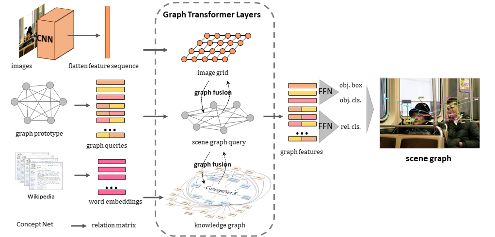
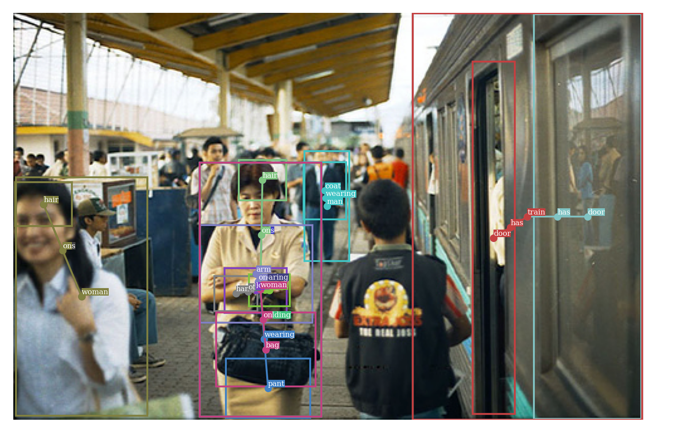
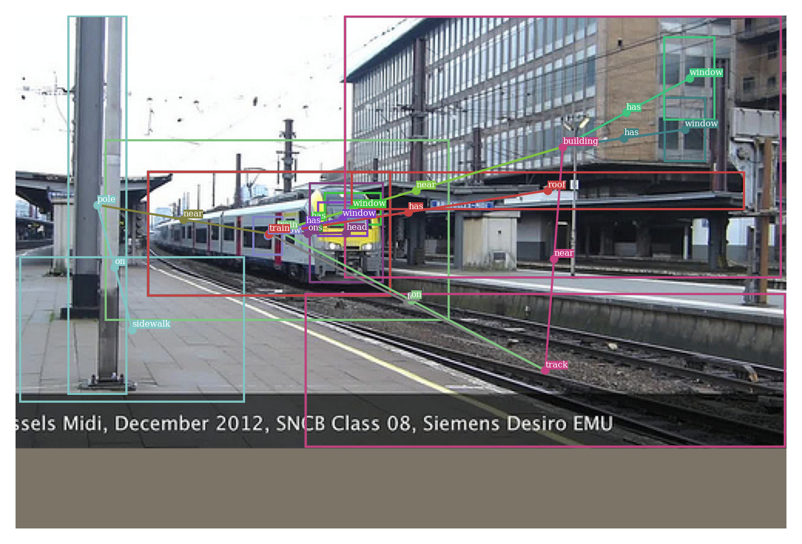
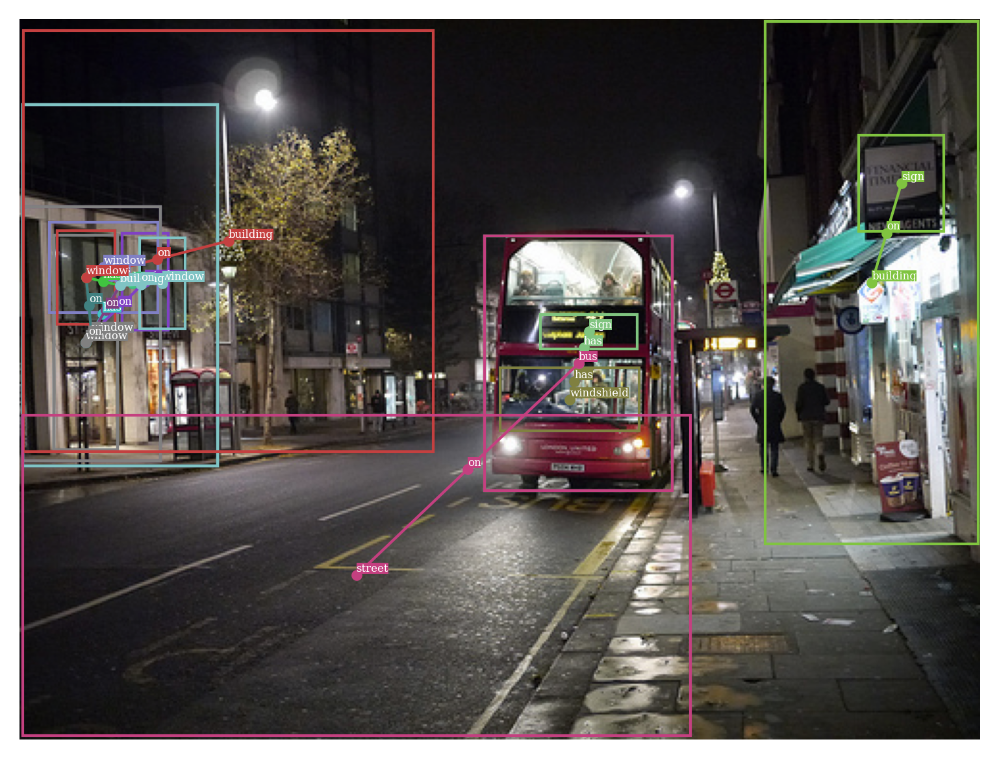

# About this code

This code is wrote based [scene-graph-benchmark](https://github.com/KaihuaTang/Scene-Graph-Benchmark.pytorch) for the [thesis](https://nbviewer.jupyter.org/github/MoChen-bop/SGGTR/blob/main/__old__/pdf/thesis.pdf) which focus on how to build an end-to-end model for scene graph generation.

# Introduction

**SGGTR** is an end-to-end model for Scene Graph Generation using TRansformer. Its structure is based on [DETR](https://arxiv.org/abs/2005.12872).

# Performance

|       |       |       |       |       |       |       |
| ----- | ----- | ----- | ----- | ----- | ----- | ----- |
|       | R@20  | R@50  | R@100 | R@20  | R@50  | R@100 |
| SGGTR | 18.75 | 24.78 | 28.93 | 20.57 | 28.12 | 33.52 |

Training logs can be found [here](https://github.com/MoChen-bop/SGGTR/blob/main/__old__/pdf/experiments.pdf).

# Visualized Scene Graphs

